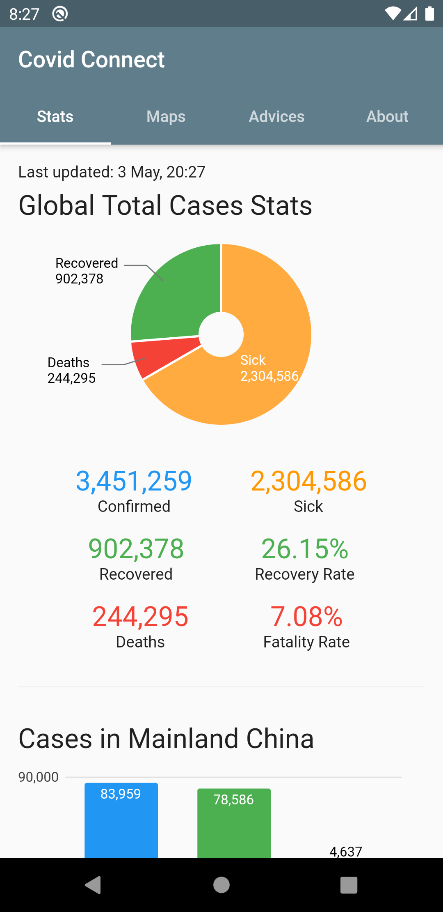
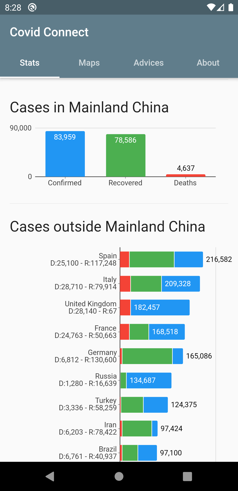
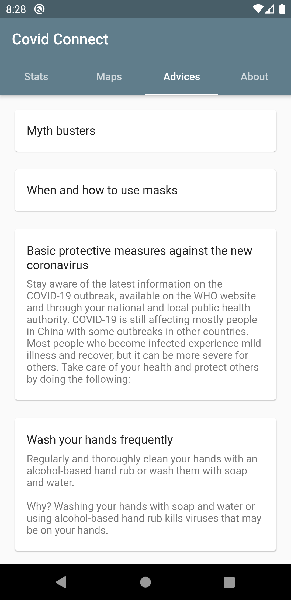
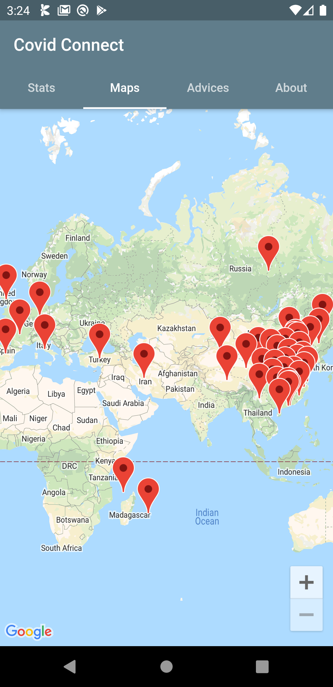

<h1 align="center">Covid 19 Corona Tracker Mobile and Web App in Flutter</h1>

 Covid Connect is a Covid 19 Corona Tracker in made Flutter, wich runs on:
 1. Android
 2. iOS
 3. Web
 4. macOS

<a href="app-release.apk">Try the APK from here</a>
<a href="https://covid-tracker-multiverse.web.app">Try the web app from here</a>

Features:
1. Platform Independent
2. Realtime count on Maps
3. Realtime count shown on Graph
4. Advices for Covid 19

  
  
  
  